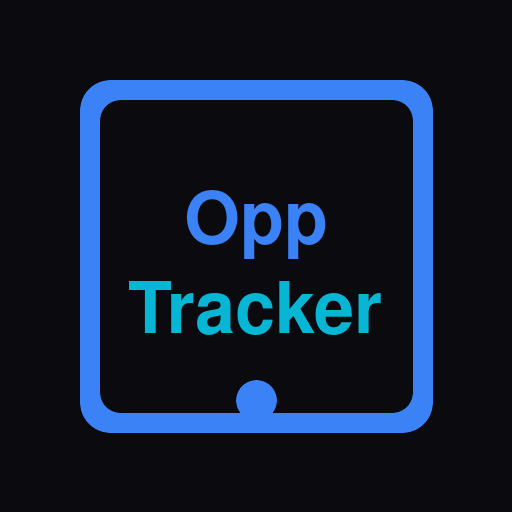

<div align="center">
  

  # OppTracker

  **Never Lose Track of an Opportunity Again**

  *A smart, AI-powered platform to manage your applications for fellowships, internships, hackathons, and funded programs.*

  [**View Live Demo**](https://opp-tracker-eta.vercel.app/)
</div>

---

## 🌟 The Problem & The Solution

Every year, millions of people apply to various programs. The process is chaotic: opportunities are scattered, deadlines are missed, writing cover letters takes too much time, and scam programs steal time and money.

**OppTracker solves all of this in one place.** It is a web-based opportunity management platform that helps you track, analyze, and apply to international programs with AI-powered assistance. It combines a clean dashboard with smart automation to turn a stressful process into a structured workflow.

---

## ✨ Core Features

- **📊 Smart Dashboard:** A real-time overview of your application pipeline with upcoming deadlines and recent activity.
- **📝 Full Opportunity Management:** Track every detail of each opportunity (Title, URL, Deadline, Status, Funding Type, Category, Location, etc.).
- **🔄 Application Status Workflow:** A structured 7-stage pipeline: `Need to Apply` ➡️ `Applied` ➡️ `Under Review` ➡️ `Interview` ➡️ `Accepted` (or `Rejected` / `Scam`).
- **🔍 Search and Filtering:** Find any opportunity instantly using text search or filters.
- **🛡️ Scam Detection & Blacklist:** Protect yourself from fraudulent programs with AI-powered analysis and a dedicated Scam List.
- **⏰ Deadline Reminders:** Automatic reminders scheduled before deadlines with color-coded countdown badges.

---

## 🤖 AI-Powered Tools

OppTracker integrates **Google Gemini** to provide intelligent assistance:

1. **URL Analyzer:** Paste any opportunity URL and the AI extracts details, requirements, and provides a scam score instantly.
2. **Cover Letter Generator:** Generate personalized cover letters in seconds tailored to the specific opportunity and your profile.
3. **Smart Chat Assistant:** A conversational AI that knows your entire tracker. Ask it for deadline summaries or which opportunities to prioritize!
4. **Scam Detector:** Analyze any opportunity for fraud signals, red/green flags, and get a clear recommendation on whether to apply.

---

## 🛠️ Tech Stack

- **Frontend:** React 19, TypeScript, Vite
- **Routing:** React Router 7
- **Styling:** Tailwind CSS 4
- **Backend / Database:** Supabase (PostgreSQL)
- **AI Integration:** Google Gemini
- **Deployment:** Vercel

---

## 🚀 Getting Started

To run OppTracker locally, follow these steps:

### Prerequisites

- Node.js installed
- A Supabase project
- A Google Gemini API Key

### Installation

1. **Clone the repository:**
   ```bash
   git clone https://github.com/Ilyasrf/OppTracker.git
   cd OppTracker
   ```

2. **Install dependencies:**
   ```bash
   npm install
   ```

3. **Environment Setup:**
   Create a `.env` file in the root directory (you can copy `.env.example`) and add your variables:
   ```env
   VITE_SUPABASE_URL=your_supabase_url
   VITE_SUPABASE_ANON_KEY=your_supabase_anon_key
   VITE_GEMINI_API_KEY=your_gemini_api_key
   ```

4. **Run the development server:**
   ```bash
   npm run dev
   ```

5. Open your browser and navigate to the local URL provided by Vite (usually `http://localhost:5173`).

---

## 🎨 Design Philosophy

- **Dark Theme:** Deep navy background with glass-morphism cards and subtle blue borders.
- **Color-Coded Status:** Instant visual recognition for different application stages (e.g., Yellow for "Need to Apply", Green for "Accepted", Red for "Scam").

---

<div align="center">
  <i>Built with ❤️ by Ilyas</i>
</div>
